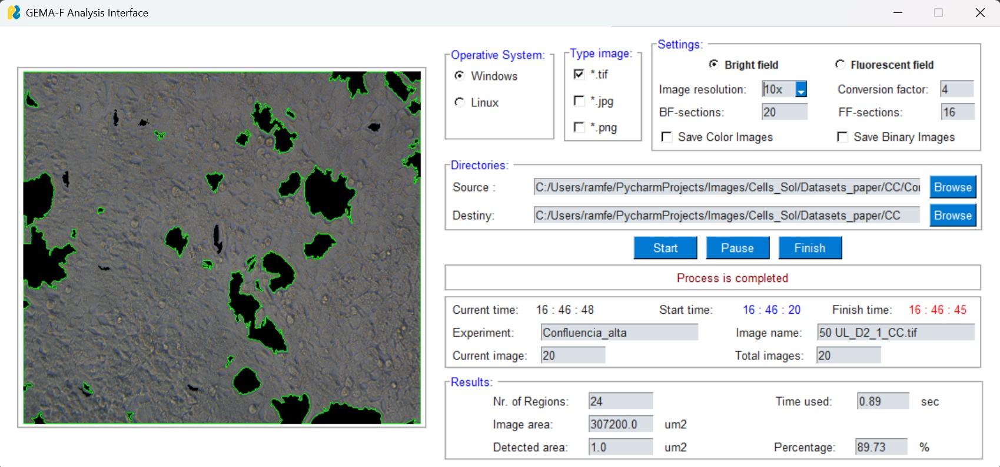
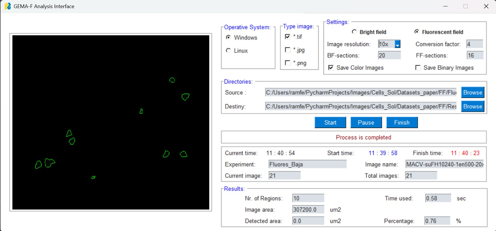

# GEMA_F_GUI
GEMA_F by **GEMA for Segmentation in bright and fluorescence fields** is a GUI Interface programmed in *PYTHON* using PySimpleGUI for segmentation and computing the area of cells automatically in image datasets.
The GUI is a test version 1.2.1 and the GEMA algorithm is an improvement for the previous version presented in https://www.mdpi.com/2313-433X/8/10/281. The current version is 3.6.8.

## Run of GEMA_F_GUI
This program can be used for cell regions using the Gabor Filter and morphological operations to improve the automatic detection of images. The GEMA algorithm runs in two fields: bright and fluorescence.

## Results of GEMA_F_GUI
Results are presented in CSV files with values of detected area in pixels and micrometers. The accuracy of the algorithm has been computed using the gold standard segmentation.

GEMA_F_GUI Interface will be presented in a **scientific paper**.
